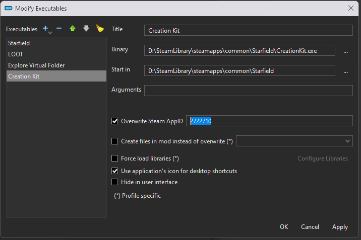

# Workflow - SFCK Paired With MO2

This part can be completed using any git client but the instructions are for fork

## Initial Setup 

- Open MO2 
- Create an empty mod named what ever helps you find it for example I used QOG-MCS for MCS
- Use the Folder icon in the toolbar and the "Open mods folder" option 
- Change into the folder for the new empty mod you created and copy its path in the address bar
- In the .env file
  - Set MODULE_DATABASE_PATH to the path above
  - Set MODULE_SCRIPTS_PATH to the same path plus "\Scripts" minus the quotes
  - Set MODULE_SCRIPTS_SOURCE_PATH to the same path plus "\Scripts\Source" minus the quotes
- Create a new executable for Creation Kit
  - Open the executables button in the toolbar
  - Select Starfield in the list
  - Click the little down arrow by the + icon and choose clone selects
  - In the binary field click the ... button and select CreationKit.exe
  - Check "Override App ID" and set the app ID to 2722710
  - Click Ok
  - 

## Reoccurring Setup  

If you have been working with another mod for example, MCS/StarSim/Core/Junk Recycler. 

- Open CreationKitPrefs.ini and find the [Papyrus] section
  - Set SDefaultNamespace, SMRUNamespace1, and SMRUNamespace2 to the correct values for this mod (see Tools/sharedConfig.ps1) for example MCS is QOG:MCS and StarSim is QOG:StarSim
    - Not sure of the purpose of SMRUNamespace1 and SMRUNamespace2

## Instructions

- Open your git client of choice (GitHub Desktop, Fork, VSCode, Visual Studio), Due to file locking these instructions will use fork.
- In the toolbar click the Fetch button to query the remote repository for any updates you are missing.
- In the toolbar click the pull button to pull the missing update to your local instance.
- If editing game data files (ESM/ESP/ESL) or model files (NIF), please follow the instruction below in "Instructions to lock a file".
  - Currently we are not supporting this due to problems with the read-only flag the system uses when the file is unlocked
- Open Visual Studio Code.
- Choose Terminal > Run Task and find "Update MO2" in the list, this script copies the repository versions of the papyrus scripts and game database files to SFCK so it can consume them.
- Do your needed work in SFCK (Launched via MO2) or VSCode for papyrus work.
  - If making papyrus changes and need to sync the updated scripts and code again; Choose Terminal > Run Task and find "Compile Papyrus Scripts (MO2)" in the list.
- When ready to commit files you need to pull in the changes from the SFCK; Choose Terminal > Run Task and find "Update Repository (MO2)" in the list.
- Stage and commit the files providing a description of what you changed
- If you locked any game data files (ESM/ESP/ESL) or model files (NIF), please follow the instruction below in "Instructions to unlock a file".
  - Currently we are not supporting this due to problems with the read-only flag the system uses when the file is unlocked
